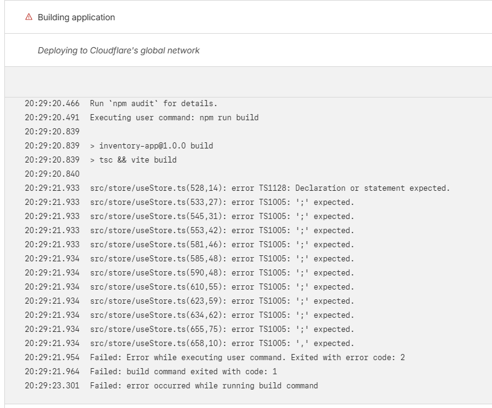
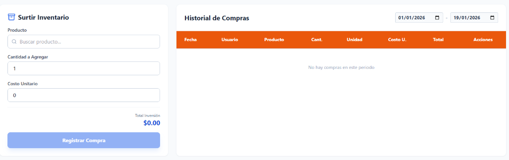

# 📦 MANUAL DE USUARIO - SISTEMA DE INVENTARIO Y VENTAS

Bienvenido al sistema de administración de Innova Clean. Este documento le guiará paso a paso en la instalación, configuración y uso del sistema.

---

## 🚀 1. Instalación Rápida

### Requisitos Previos
*   Computadora (Windows 10/11 recomendado).
*   Acceso a Internet.
*   Tener instalado **Node.js** (Versión 18 o superior). [Descargar NodeJS Aquí](https://nodejs.org/).

### Pasos
1.  **Descomprimir:** Extraiga el contenido de la carpeta `inventory-app-new` en su PC (Ej: `C:\Sistemas\Inventario`).
2.  **Abrir Consola:** 
    *   Entre a la carpeta descomprimida.
    *   Escriba `cmd` en la barra de dirección de arriba y presione Enter.
3.  **Instalar Dependencias:**
    *   En la ventana negra (consola), escriba: `npm install`
    *   Espere a que termine el proceso.
4.  **Iniciar el Sistema:**
    *   Escriba: `npm run dev`
    *   Se abrirá el sistema en su navegador automáticamente.

---

## 🗄️ 2. Configuración de Base de Datos (Supabase)

El sistema utiliza **Supabase** (una base de datos gratuita en la nube) para guardar su información segura y accesible.

1.  Cree una cuenta en [supabase.com](https://supabase.com).
2.  Cree un "Nuevo Proyecto" (New Project).
3.  Vaya a **Project Settings > API** y copie:
    *   Project URL
    *   Anon / Public Key
4.  En la carpeta del sistema, cree un archivo llamado `.env` y pegue los datos:
    ```
    VITE_SUPABASE_URL=su_url_aqui
    VITE_SUPABASE_ANON_KEY=su_clave_aqui
    ```
5.  **Cargar Tablas:**
    *   Vaya al **SQL Editor** en Supabase.
    *   Abra el archivo `database_setup.sql` que viene en esta carpeta.
    *   Copie todo el contenido y péguelo en el editor de Supabase.
    *   Presione **RUN**.
    *   ¡Listo! Su base de datos está creada.

---

## 📖 3. Guía de Uso

### 🔐 Inicio de Sesión
Ingrese con las credenciales por defecto (puede cambiarlas después en Usuarios):
*   **Usuario:** `admin`
*   **Contraseña:** `admin`



### 🛒 Módulo de Ventas
Aquí es donde realizará la mayor parte del trabajo.
1.  **Buscar Producto:** Escriba el nombre o escanee el código.
2.  **Agregar:** Seleccione la cantidad. El precio (Menudeo/Mayoreo) se ajusta automático según la cantidad.
3.  **Client:** Seleccione "Público General" o un cliente específico.
4.  **Cobrar:** Elija Método de Pago (Efectivo, Tarjeta, Monedero) y Finalizar.



### 📦 Inventario y Compras
Para surtir su tienda:
1.  Vaya a **Compras**.
2.  Seleccione el producto y la cantidad que llegó.
3.  Ingrese el costo.
4.  Al guardar, el stock del producto aumentará automáticamente.

### 💰 Gastos
Registre aquí salidas de dinero como Renta, Luz o Sueldos para que el reporte de utilidad sea real.

### 📊 Reportes e Historial
En la sección **Historial**:
*   Vea todas las ventas del día o mes.
*   **Cancelar Ventas:** Si se equivocó, cancele la venta aquí. El dinero y el stock se ajustan solos.
*   **Exportar:** Descargue reportes en Excel o PDF listos para imprimir.

---

## 🆘 Solución de Problemas Comunes

*   **"Error de Conexión":** Verifique su archivo `.env` y que tenga internet.
*   **"No guarda la compra":** Asegúrese de haber ejecutado el script `database_setup.sql` completo.
*   **"Fecha incorrecta":** El sistema usa la fecha local de su computadora. Verifique que su reloj esté bien.

---
*Generado por Antigravity AI - 2026*
